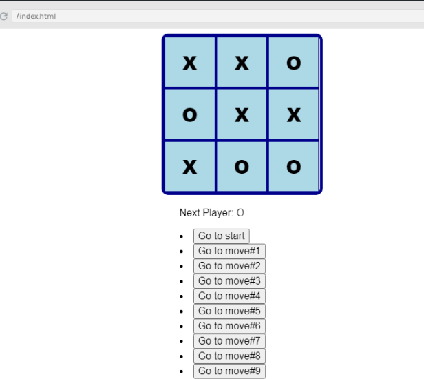

# TIC_TAC_TOE
tic-tac-toe game using react project
Here I've implemented this game using react so i have mostly concentrated on the react part apart from styling so i haven't syled well 
I've uploaded the screenshot of the app and also a mp4 file of screen recorded play so that one can easily understand the game well enough 

 

Just like other games if you guys have played the chance of of other guy by mistake you can time travel bck of how many steps you may require depends on you 
I think this is the good feature incorporated in this game.
